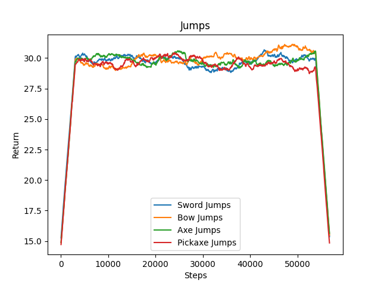

## https://youtu.be/pGWn3Qk2nfc

# Final Report

## Project Summary
Creating a PVP/PVE bot is relatively easy. All you need is an algorithm that moves both the curser and the agent to the target. Once the agent is in range all the algorithm must then do is either fire or attack. However, then the bot would be extremely predictable and unable to form strategies. Thus the goal of this project is not to create just a PVP/PVE bot but to analyze the effects of training protocols, and environmental changes in the context of Minecraft based combat to see the differences in agents trained upon different weapons. 
	To try to accomplish this we created two different models, one for agent vs agent combat and one for agent vs zombie combat. The model agent vs zombie is trained using DQN, using the collective experience of all agents of a given episode as its data. The model that modelled the agent versus agent combat was modelled using ray’s rllib proximal policy optimization algorithm.=-
	

## Approach

In this project, we employed two different approaches one where we trained agents against a horde of zombies and the other where we pitted 4 agents with varying weapons against each other.  

The approach where agents were pitted against a horde of zombies used a DQN network trained using the MarLo and ChainerRL libraries. There was a single agent, trained with a randomized weapon, that would be pitted against a variable amount of zombies. The arena is a 20x20 with a fence surrounding it. The agent is able to move, turn, attack, use, and strafe.
A DQN algorithm uses a neural network to approximate the following Q function.

Each episode is ran until either a zombie dies, or the agent dies. We define a reward function that is dependent on the damage the agent is able to deal, zombie death, and agent death. The immediate reward given to a frame for dealing damage is to help speed up the learning process.
This approach on learning combat on a PvE scenario is interesting in that zombies already have inbuilt strategies that agents have to then play around. Unlike in the agent vs agent case where players may potentially learn to just run away from each other, zombies are programmed to run towards the agent without regard of their own life, which forces the agent to learn a different strategy.
Due to the limitation of student-budget capable compute power, we were able to train the agent enough to survive longer and hit zombies, but it was unable to converge to an optimal solution as we did not have enough time on GPU’s to train for convergence. Malmo bugs and the occasion breakage of MarLo’s model saving code did slow down our ability to train and easily study learned agent strategies. DQN is also an inherently unstable model, and without permanent access to good compute, we were unable to spend the necessary amount of time to hyperparameter tune.

The approach where agents were pitted against each other used a proximal policy optimization algorithm from ray’s rllib library to train and control the agents.  The PPO algorithm uses trust regions, which is dependent on the KL Divergence given by the old and new policy. Formally,

This algorithm voids having to establish correct step sizes that policy gradient algorithms such as DQN struggle with. This makes PPO easier to train.
The PPO had a dedicated policy for each agent.  The agents sent an observation space of 11 x 11 x 11 cube with the agent centred on the bottom layer, air as 0s, bedrock as 1s, stone as 2s, and other agents as 99. The trainer sent back a list of 5 integers representing: move, turn, attack, use, and jump. 
The arena was a 22 x 22 bedrock square enclosed with walls 3 heigh to stop agents from breaking their way out. The agents were spawned at 5 blocks away from the centre at coordinates (5, 2, 0), (-5, 2, 0), (0, 2, 5), (0, 2,-5) respectively. The arena was also randomly strewn with 2 high stone pillars that agents could use to block line of sight or to get a height advantage.
Each weapon had its own class of agent to control weapon-specific details. There was a superclass that each of these bots inherited from that controlled all of the shared information such as resetting, initializing shared variables, and shared action commands. 
This has the theoretical advantage of producing more interesting results as agents have to account for each other. However, there were a plethora of problems that compounded to make this difficult. Firstly, Malmo the training environment is not built to support damaging other agents as they are not considered other entities in the documentation. Therefore, the only way to check for damage done to other agents was to look every step and see if the amount of damage an agent has dealt has increased. The second problem is that there is a constant natural health regeneration that could not be turned off as there was no option in the missionXML nor was the Minecraft gamerule command “doNaturalRegen false” effective in disabling this regeneration. The final problem was due to the massive computer resources needed to run the programs. Very rarely when Malmo was setting up the environment some agents would become unresponsive and the mission would end due to not enough agents responding. This is why no agent was able to reach past 25000 steps.

## Evaluation
For the agent vs zombie model, we analyzed the average reward over time, as well as the average time survived in the episode.

This graph shows the reward over the episodes averaged over its neighbors. There’s a clear upwards trajectory, and it’s quite clear that the agent has not fully learned its optimal policy yet, as the reward function has not tapered off and is still increasing. Running another 1000-2000 episodes is probably needed for model convergence.

This graph shows the episode length-  either how long the agent survives for, or until the agent kills a zombie. As shown by the lack of positive reward in the prior example, it’s clear that the agent is not killing zombies often yet. However, paired with this graph, it’s starting to both learn how to survive and learn to do combat. Towards the tail end of the plot, it is clear that on average, the agent needs ~120 timesteps to both acquaint itself with its surroundings safely, and then slowly learn to kill the zombie.

This is consistent with our previous assumption that the model has not yet converged. By the time we were able to stop our experiments, it’s clear that the agent starts to learn what the environment means, and what obstacles it needs to be cognizant of. The slow rise to a positive average reward then reinforces the idea that it has begun to learn a strategy to kill zombies.

For the agent vs agent model, there are a few quantitative and qualitative metrics that we looked at to determine the success. The three quantitative measures that we looked at is the damage dealt with a penalty for death, accuracy, and movement. The qualitative metric was the positioning of the agents based upon their respective advantages. These metrics were compared over three trials each of which made it to around 20000 steps. Either due to the inability to train the agents for a long enough time or the inconsistent data returned from Malmo, there were very few differences between agents of different weapons. 

The first metric was the damage an agent deals to all the other agents with a 100 point deduction for dying (Results shown above). Every step we parsed the message to get the damage that the agent dealt since the last step. This was then returned as the reward for each step.

We did not get any agent deaths so we cannot conclude that agents have learned to fight. However, there is an interesting correlation between the scores of the sword and the axe agent. Whenever the score of the sword agent starts to increase the score of the axe agent decreases and vice versa.

The second quantitative metric is the accuracy of each agent where we looked at the number of hits compared to the number of attacks made by each agent. Overall the amount of attacks remains relatively constant. The only reason an agent would not spam attacks is that Minecraft itself penalizes spamming attacks and due to the inconsistencies of damage reporting we believe that the agents did learn about that mechanic. However, similarly to the damage done there was a negative correlation between the sword and the axe.	

The third quantitative metric was the movement of the agents. Particularly the number of jumps and the total distance travelled. Both of which remained relatively constant throughout the runs. Because of this, we do not believe that the agents learned to use the pieces of stone as cover because if they had there would have been a decrease in the number of jumps for at least a few hundred steps as jumping would have given other agents a chance to hit an agent using cover.

Similarly, distance remains constant which we believe shows that an agent did not learn to pathfind to any particular agent as there would have been a reduction in total distance travelled. The reason for the archer’s lower distance travelled was due to the debug given to a user holding a bow at full draw and not it staying still.

Due to these results, we believe that the agents in an agent versus agent environment did not learn to effectively use their weapons. Whether this is due to the inconsistencies of Malmo or some other factor is unknown.
	
## Resources Used
https://github.com/petrosgk/MalmoRL

https://github.com/crowdAI/marLo 

https://github.com/keras-rl/keras-rl

https://github.com/microsoft/malmo

https://docs.ray.io/en/latest/index.html

